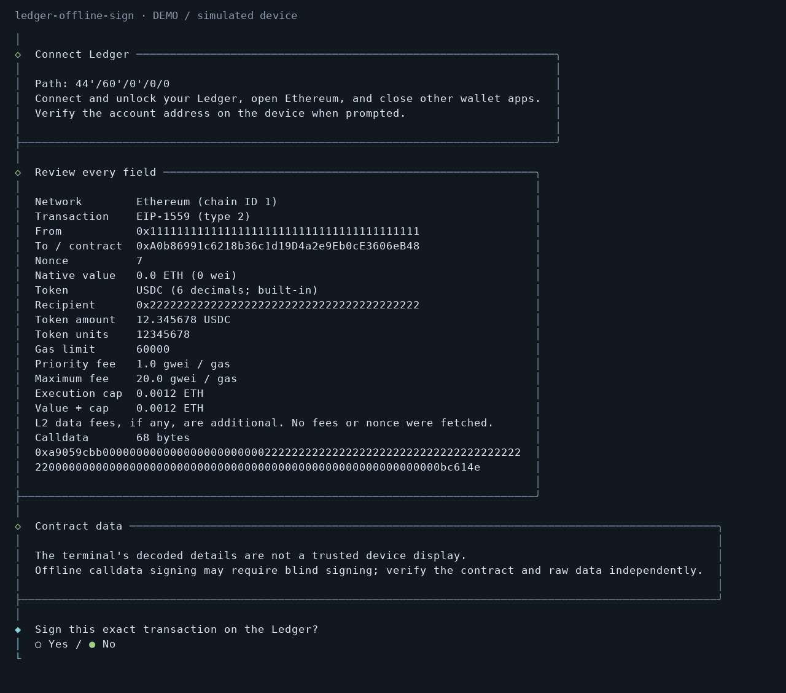

# Ledger Offline Sign

Sign EVM transactions with a USB Ledger. Supports native transfers, ERC-20
transfers, and custom calldata. Signing works offline; public lists and RPC
broadcasting are optional.



## Run locally

Requires Node.js 22+ and the Ledger Ethereum app.

```sh
git clone https://github.com/ustas-eth/ledger-offline-sign.git
cd ledger-offline-sign
npm ci
npm start
```

To install the checkout as a command, run `npm install -g .`, then
`ledger-offline-sign`. The npm registry release may lag behind this checkout.
Install dependencies before disconnecting from the network; `npx` can download
packages at runtime.

On Debian/Ubuntu, native USB builds may need `build-essential python3 pkg-config
libusb-1.0-0-dev libudev-dev`. Other distributions need equivalent packages. If
USB access fails, check [Ledger's udev rules](https://github.com/LedgerHQ/udev-rules).
Don't run the utility as root.

## Sign

Choose an account, network, and transaction. Enter the nonce, fees, and gas limit;
the app does not fetch or estimate them. Common chains and tokens appear first.
Use a custom contract or derivation path when needed.

Native amounts accept `wei`, `gwei`, or `ether`; a bare number means wei. Token
amounts use the selected token's decimals. Only EIP-1559 transactions and chains
with 18-decimal native units are supported.

Connect the Ledger, unlock it, open Ethereum, and close other wallet apps. Verify
the address on the device, review the transaction, then approve signing. The
result is printed as one line of raw signed bytes. Anyone holding those bytes
can broadcast the transaction.

Contract calls may require blind signing. Check the contract, recipient, amount,
and calldata independently. The fee cap shown covers execution gas; extra L2
data fees are not included.

## Lists and broadcasting

```sh
npm start -- --online          # Public lists and optional broadcasting after signing
npm start -- --refresh-lists   # Download lists, then exit; no Ledger needed
npm start -- --lists           # Use cached lists while offline
npm start -- --broadcast       # Paste an existing signed transaction and select an RPC
npm start -- --local-only      # Sign, then optionally broadcast through a local node
```

Lists come from [Chainlist](https://chainlist.org/) and
[Uniswap](https://github.com/Uniswap/default-token-list). Online mode refreshes
lists older than 24 hours. Cached lists remain usable offline. Type to search
list menus; `--testnets` includes test networks. `--no-cache` skips cache reads
and writes.

Broadcasting uses the RPC you select. The picker lists endpoints from the cached
chain list, plus local and custom options. Add `--online` to `--broadcast` to
fetch lists if needed. **Choose RPC** checks the endpoint's chain ID. Only
**Broadcast now** sends the transaction; **Cancel** sends nothing. If the check
fails, retry or choose another RPC without re-entering details or signing again.
It never retries or switches providers automatically. Errors after sending report
an unknown outcome. A successful submission means the RPC accepted the
transaction, not that it was mined.

Providers claiming no request logging appear first. These are attributed claims,
not verified privacy guarantees. The RPC receives your IP and transaction;
broadcasting makes transaction data public.

No wallets, signed transactions, custom RPC URLs, or search history are saved.
Only public lists are cached. Terminal scrollback and external recording can
retain what you see or enter. [Privacy details](docs/privacy.md).

The screenshot uses a simulated Ledger and dummy addresses.
See [CONTRIBUTING.md](CONTRIBUTING.md) for tests and packaging.
